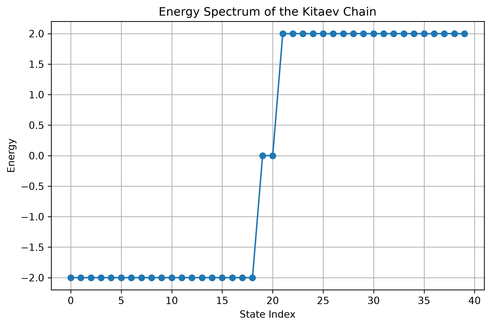
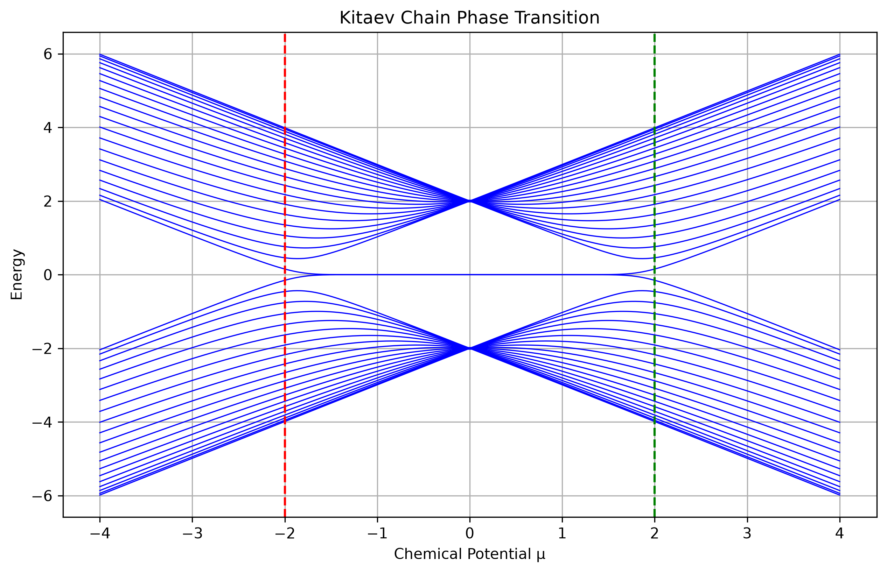
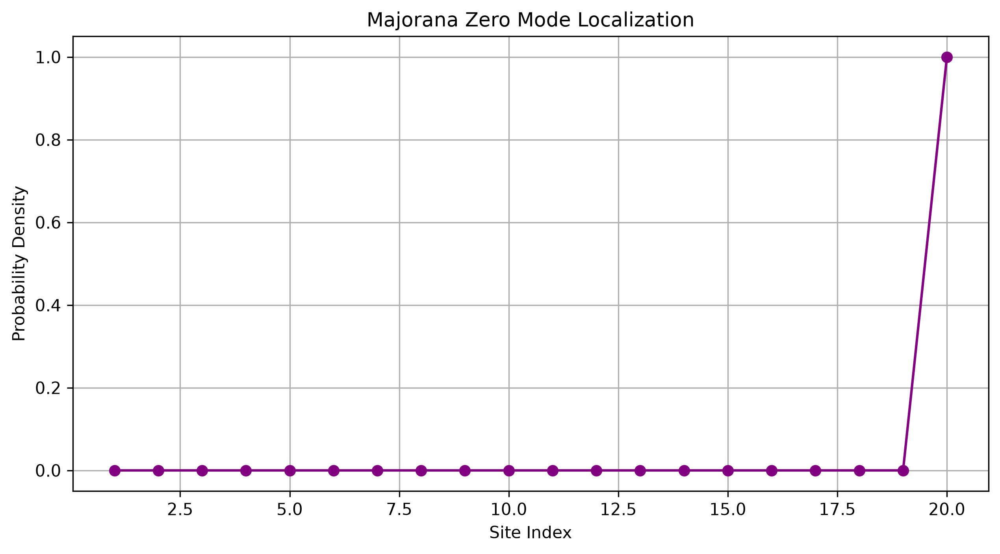
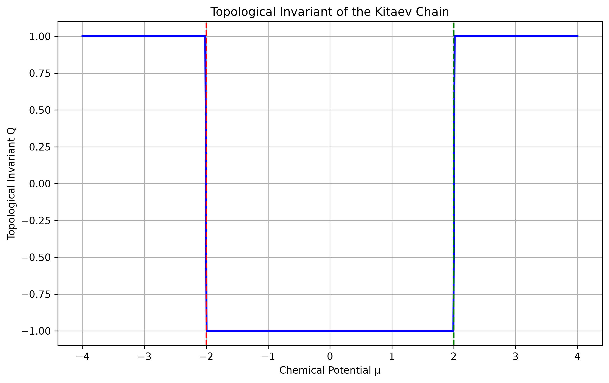
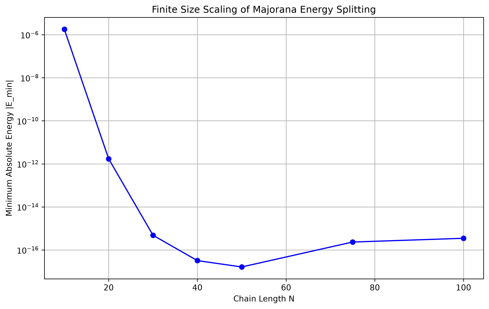

# Results

## Overview

This project investigated the Kitaev chain model through numerical simulation and analyzed the emergence of Majorana zero modes and topological superconductivity.

Five primary numerical results were obtained:

1. Energy Spectrum Analysis
2. Topological Phase Transition
3. Majorana Localization
4. Topological Invariant Calculation
5. Finite-Size Scaling

---

# Result 1: Energy Spectrum

## Observation

The energy spectrum exhibits the particle-hole symmetry expected from the Bogoliubov-de Gennes formalism.

Positive and negative energy states appear in symmetric pairs around zero energy.

Two states were observed extremely close to zero energy, with the minimum absolute energy approximately

$$
4.44 \times 10^{-16}
$$

which is effectively zero within numerical precision.

## Conclusion

The presence of near-zero-energy states provides the first numerical indication of Majorana zero modes.

---

# Result 2: Topological Phase Transition

## Observation

The energy spectrum was calculated over the interval

$$
-4 \leq \mu \leq 4
$$

A pair of zero-energy states persists within

$$
-2 < \mu < 2
$$

and disappears outside this interval.

The critical points occur at

$$
\mu = -2
$$

and

$$
\mu = +2
$$

which agree with theoretical predictions.

## Conclusion

The Kitaev chain undergoes a topological phase transition at

$$
|\mu| = 2t
$$

separating the topological and trivial phases.

---

# Result 3: Majorana Localization

## Observation

The probability density of the zero-energy eigenstate is concentrated almost entirely at the boundary of the chain.

The edge localization is particularly strong for

$$
\mu = 0
$$

and

$$
t = \Delta
$$

where the Majorana mode becomes perfectly localized.

## Conclusion

The zero-energy state is an edge state rather than a bulk state, providing direct numerical evidence for a Majorana zero mode.

---

# Result 4: Topological Invariant

## Observation

The topological invariant changes abruptly at

$$
\mu = -2
$$

and

$$
\mu = +2
$$

The invariant takes the value

$$
Q = -1
$$

within the interval

$$
-2 < \mu < 2
$$

and

$$
Q = +1
$$

outside this region.

## Conclusion

The invariant confirms the existence of a non-trivial topological phase supporting Majorana edge modes.

---

# Result 5: Finite-Size Scaling

## Observation

The minimum energy splitting decreases rapidly as the chain length increases.

For short chains, finite overlap between edge Majorana modes produces a measurable energy splitting.

As the chain becomes longer, the splitting approaches zero.

For chain lengths greater than approximately

$$
N = 30
$$

the energy reaches the numerical precision limit of the simulation.

## Conclusion

The results demonstrate how topological protection improves with increasing chain length and how Majorana modes become increasingly decoupled.

---

# Overall Conclusions

The numerical simulations successfully reproduce the key physical properties of the Kitaev chain.

The results demonstrate:

- Particle-hole symmetry
- Topological phase transitions
- Majorana edge localization
- Non-trivial topological order
- Finite-size protection of Majorana modes

The agreement between energy spectra, localization analysis, topological invariants, and finite-size scaling provides strong evidence for the existence of Majorana zero modes in the topological phase of the Kitaev chain.

These findings are consistent with theoretical predictions and illustrate the fundamental concepts underlying topological superconductivity and topological quantum computation.